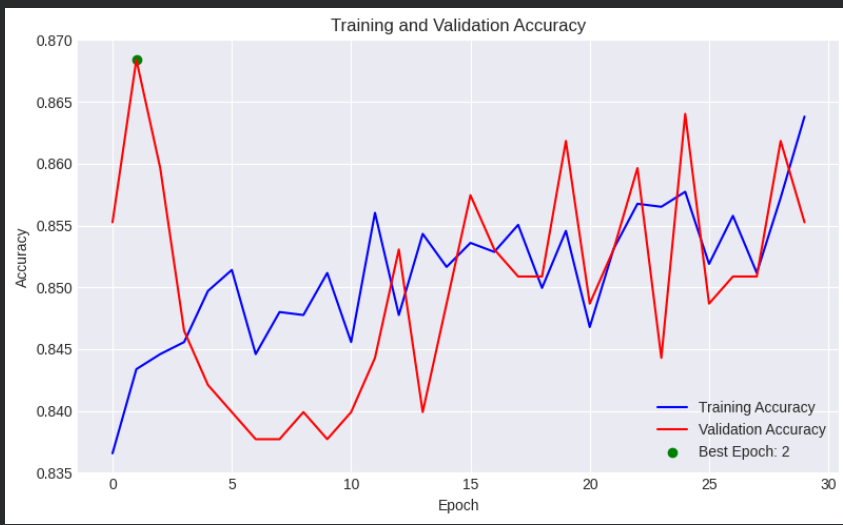
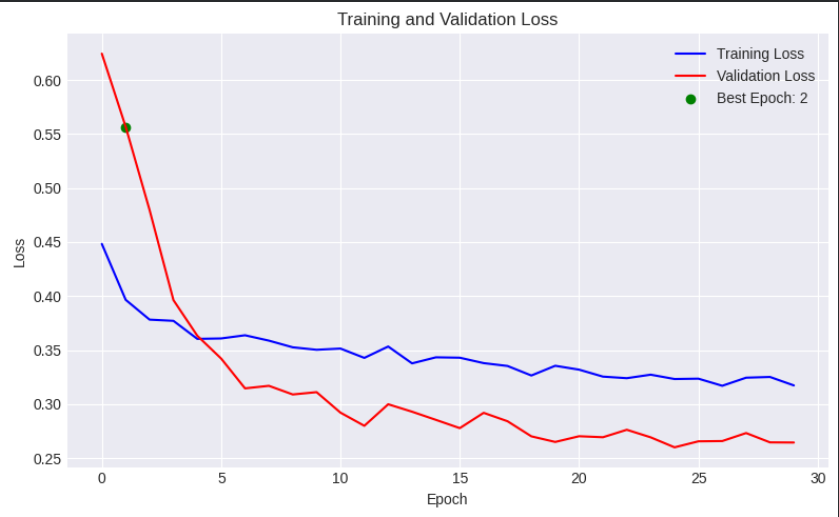

# Enhanced Deep Learning Techniques for Multi-Class Classification of Lung Disorders in Chest X-Rays

## 📌 Project Overview
This project implements a multi-class lung disease classification system using chest X-ray images from the NIH dataset (100K+ images).

## 📄 Publication

This research work was published at ICERECT-2025 (IEEE Technically Sponsored Conference).

🔗 IEEE Xplore: https://ieeexplore.ieee.org/document/11376083


## 🧠 Model Architecture
- EfficientNetV2-M (Transfer Learning)
- Custom Dense Classification Head
- Fine-tuning of higher layers

## 📂 Dataset

This project uses the NIH Chest X-ray dataset, publicly available on Kaggle:

🔗 https://www.kaggle.com/datasets/nih-chest-xrays/data

- Contains 100,000+ frontal chest X-ray images  
- Annotated with multiple lung disease labels  
- Used for multi-class medical image classification  

⚠️ Due to large size, the dataset is not included in this repository.

## ⚙️ Techniques Used
- Image Resizing & Normalization
- Data Augmentation
- Class Balancing
- Early Stopping
- Confusion Matrix Analysis

## 📊 Results
- Validation Accuracy: 85.53%
- Evaluated using Precision, Recall, and F1-score
## 📈 Training & Validation Accuracy


## 📉 Training & Validation Loss


## 🚀 How to Run (Google Colab + Kaggle Dataset)

### 1️⃣ Download Dataset
Download the NIH Chest X-ray dataset from Kaggle using the link above.

### 2️⃣ Upload to Google Drive
Upload the dataset folder to your Google Drive.

### 3️⃣ Open Notebook in Google Colab
Upload `chest_x_ray.ipynb` to Google Colab.

### 4️⃣ Mount Google Drive
```python
from google.colab import drive
drive.mount('/content/drive')
```

### 5️⃣ Update Dataset Path
Modify the dataset directory path inside the notebook to match your Drive location.

### 6️⃣ Enable GPU
Runtime → Change Runtime Type → Select GPU

### 7️⃣ Run All Cells
Execute all notebook cells sequentially.

## 🛠️ Technologies
Python, TensorFlow, Keras, OpenCV, NumPy, Matplotlib, Google Colab

## 📄 Publication

This research work was published at ICERECT-2025 (IEEE Technically Sponsored Conference).

🔗 IEEE Xplore: https://ieeexplore.ieee.org/document/11376083


